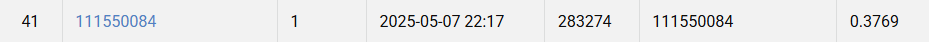

## NYCU Computer Vision 2025 Spring HW3
- Student ID: 111550084
- Name: 林辰恩

### Introduction
This project implements an instance segmentation pipeline for medical cell images using Mask R-CNN. The model is trained to detect and segment individual instances of four types of cells in .tif images. A modified maskrcnn_resnet50_fpn_v2 backbone is used, with support for 5 classes (4 cell types + background).

### How to install 👹
```bash
git clone https://github.com/seapa1108/NYCU-Computer-Vision-HW3
cd NYCU-Computer-Vision-HW3
pip install torch torchvision torchaudio --index-url https://download.pytorch.org/whl/cu124
pip install matplotlib tqdm torchmetrics scipy opencv-python
```
```bash
python model.py         # Train the model and run validation
python gen_pred.py      # Run inference on the test set using a trained model
```

### Performance Snapshot
<p align="center">
  
</p>